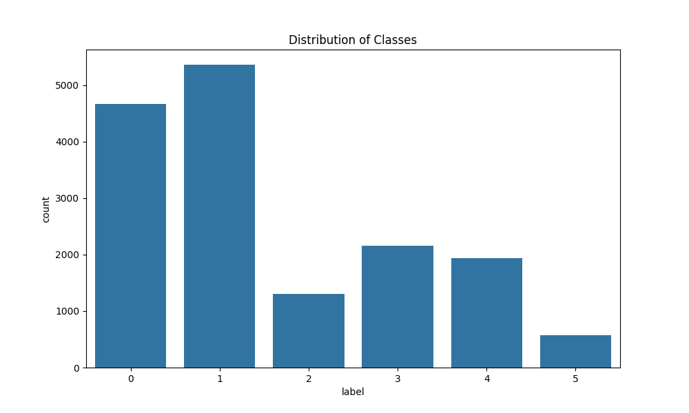
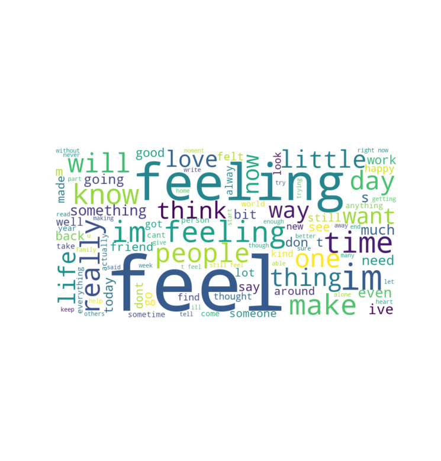
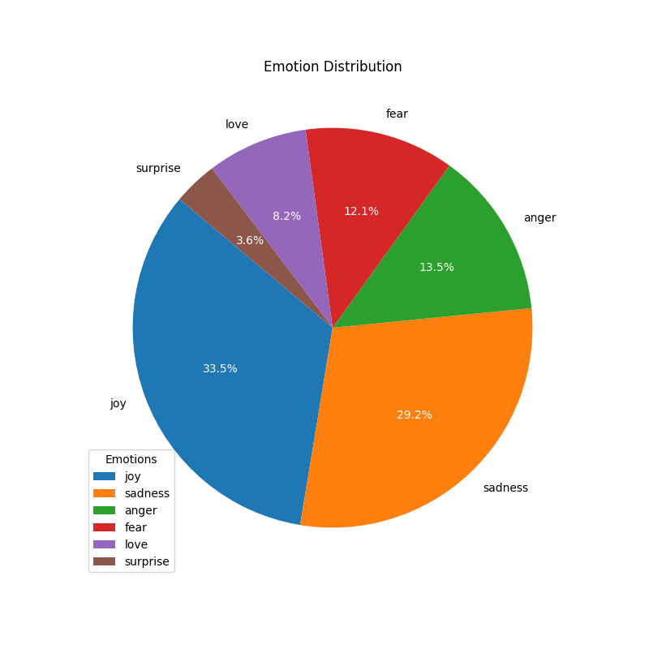

This project uses a multiclass classification approach with six emotions: `anger`, `love`, `fear`, `joy`, `sadness`, and `surprise`. Models implemented include Logistic Regression, Random Forest, SVM, and BERT.

## Models Used
- Logistic Regression
- Random Forest
- Support Vector Machine (SVM)
- BERT (Transformers)

## Dataset
- Kaggle Dataset: [Emotion Dataset](https://www.kaggle.com/datasets/parulpandey/emotion-dataset)

### 🔢 Evaluation Metrics

| Model               | Precision | Recall | F1-Score | Accuracy |
|--------------------|-----------|--------|----------|----------|
| Logistic Regression| 0.86      | 0.76   | 0.80     | 86.6%    |
| Random Forest      | 0.84      | 0.80   | 0.82     | 87.35%   |
| SVM                | 0.82      | 0.77   | 0.79     | 85.2%    |
| BERT               | 0.89      | 0.89   | 0.88     | 89.0%    |

## Visualizations

### Class Distribution


### Word Cloud


### Emotion Breakdown


## Conclusion

The project highlights the application of machine learning and deep learning models for effective emotion detection on Twitter data. Among all models tested, BERT performed the best with an **89% accuracy**, followed closely by Random Forest and Logistic Regression.

## How to Run

1. Clone the repo:
   ```bash
   git clone https://github.com/yourusername/twitter-emotion-detection.git
   cd twitter-emotion-detection
   ```

2. Install dependencies:
   ```bash
   pip install -r requirements_bert.txt
   ```

   ```bash
   pip install -r requirements_ML.txt
   ```

3. Run a model:
   ```bash
   python twitter_emotion_classification_Bert.py
   ```
   ```bash
   python twitter_emotion_classification_sml_rf_lr.py
   ```

## License
This project is licensed under the MIT License - see the [LICENSE](LICENSE) file for details.
